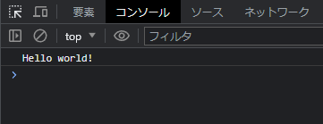
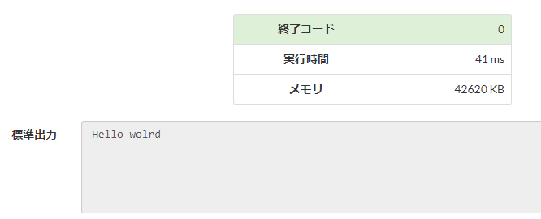
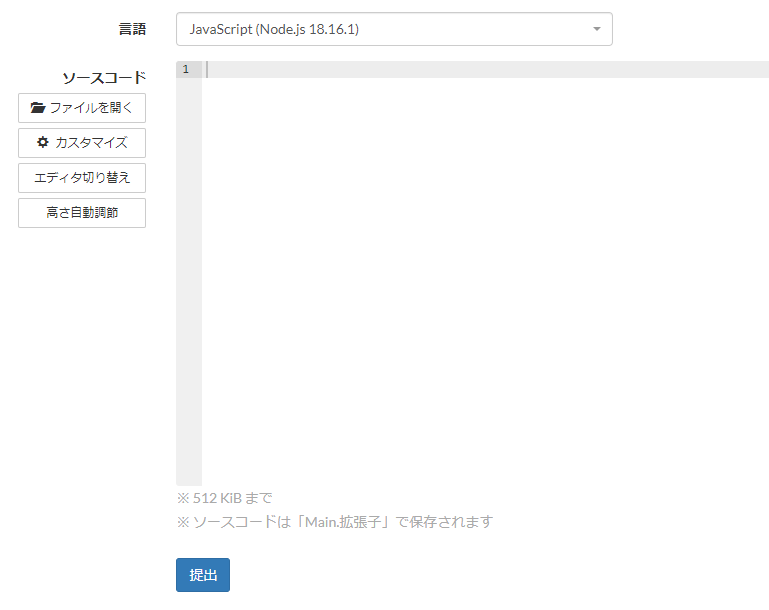
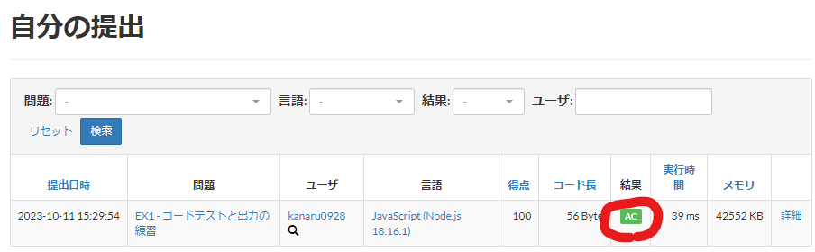

<!--
_class: title
_paginate: false
-->

# team411研修資料
## 項目1. Hello, world

---
<!--
class: slides
-->
# プログラミングとは
**コンピュータに対する命令**を書くこと。

```js
load JIntMainRet1
store IntRet
jump Int
JIntMainRet1: jump IntMainRet1
IntMainRet1: load Ret
store MainA
store IntAddArgX
load JIntMainRet2
store IntRet
```

---
# プログラミングのルール
## 順次
- 上から順番に実行される
## 分岐
- 実行する命令を分岐させる
- ex. ruby, JSの`if`文
## 繰り返し
- 命令を繰り返す
- ex. rubyの`while`文

---
# Hello world
JavaScriptで"Hello world"と表示します。
## HTMLを使う方法
1. `index.html`と`script.js`を同じディレクトリに配置 

---
2. `index.html`に以下を記入(コピペOK)
```html
<!DOCTYPE html>
<html lang="en">
<head>
  <meta charset="UTF-8">
  <meta name="viewport" content="width=device-width, initial-scale=1.0">
  <script src="script.js"></script>
  <title>kensyu</title>
</head>
<body>
</body>
</html>
```
---

3. `script.js`に以下を記入
```js
console.log("Hello world");
```
4. `index.html`をブラウザで開いてF12キーを押す
1. 検証ツールのConsoleタブを開いて結果を確認

---
## AtCoderのコードテスト
1. AtCoderに新規登録
https://atcoder.jp/register
1. コードテストに以下を入力
```js
console.log("Hello world");
```
コードテスト: https://atcoder.jp/contests/APG4b/custom_test
> コードはコードテストに直接書くよりも、VSCode等に書いてからコピペする方が良い。

3. 言語を`JavaScript (Node.js 18.16.1)`に設定

3. `実行`を押す

---
# 実行結果の例
| HTMLの結果                   | AtCoderの結果 |
|-----------------------------|--------------|
|  |  |

---
# 演習問題
1. APG4b EX1 (C++用の解説が載っていますが、今回はJSなので無視してください)
https://atcoder.jp/contests/APG4b/tasks/APG4b_cv

---
# AtCoderの提出方法
| 手順  |  |
|:-----|:-----|
| ソースコード欄にコードを書き、提出ボタンを押す |  |
| 結果欄に`AC`と表示されれば正解 |  |

---
# 参考
## ログの種類
ログには様々な種類があります。今回使った`console.log`は通常の標準出力ですが、`console.error`とすると標準エラー出力として出力され、表示色も変わります。それ以外にも、JavaScriptには便利な出力方法がたくさんあります。目的に応じてログを使い分けるようにしましょう。
## 関連リンク
https://qiita.com/baby-degu/items/1046763163bc794870ea
